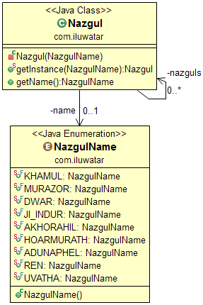

## Creational 构造模式

1. Abstract Factory
2. Adapter


### Abstract Factory

**使用场景：**

- a system should be independent of how its products are created, composed and represented  （系统必须将产品的创建，组成和展现分离）
- a system should be configured with one of multiple families of products  （系统由相似的产品组成）
- a family of related product objects is designed to be used together, and you need to enforce this constraint(相关的对象需要用在一起，而你又需要强制这种约束)
- you want to provide a class library of products, and you want to reveal（显示，揭露） just their interfaces, not their implementations


### Adapter
**使用场景：**

- you want to use an existing class, and its interface does not match the one you need（你想使用一个已经存在的类，但是他的接口和你需要的不匹配）
- you want to create a reusable class that cooperates with unrelated or unforeseen classes, that is, classes that don't necessarily have compatible interfaces
- you need to use several existing subclasses, but it's impractical to adapt their interface by subclassing every one. An object adapter can adapt the interface of its parent class. （***<font color="red">这里我暂时还不清楚</font>***）


### Builder

**使用场景：**

* the algorithm for creating a complex object should be independent of the parts that make up the object and how they're assembled  （构造分离）
* the construction process must allow different representations for the object that's constructed（构造器必须允许对象的不同表现形式）


### Multiton  （多例，又叫Registry）
**使用场景：**

* Ensure a class only has limited number of instances, and provide a global point of access to them.（确保一个类只有有限的实例，切需要提供一个全局的入口用于获取他们）



```java
  static {
    nazguls = new ConcurrentHashMap<>();
    nazguls.put(NazgulName.KHAMUL, new Nazgul(NazgulName.KHAMUL));
    nazguls.put(NazgulName.MURAZOR, new Nazgul(NazgulName.MURAZOR));
    nazguls.put(NazgulName.DWAR, new Nazgul(NazgulName.DWAR));
    nazguls.put(NazgulName.JI_INDUR, new Nazgul(NazgulName.JI_INDUR));
    nazguls.put(NazgulName.AKHORAHIL, new Nazgul(NazgulName.AKHORAHIL));
    nazguls.put(NazgulName.HOARMURATH, new Nazgul(NazgulName.HOARMURATH));
    nazguls.put(NazgulName.ADUNAPHEL, new Nazgul(NazgulName.ADUNAPHEL));
    nazguls.put(NazgulName.REN, new Nazgul(NazgulName.REN));
    nazguls.put(NazgulName.UVATHA, new Nazgul(NazgulName.UVATHA));
  }

  private Nazgul(NazgulName name) {
    this.name = name;
  }

  public static Nazgul getInstance(NazgulName name) {
    return nazguls.get(name);
  }
```

代码中 `getInstance `中用的是map获取对象实例的，而不是用得new，这样的好处就是不用每次都去new一个实例。


# Twin

**使用场景：**  
* Twin pattern is a design pattern which provides a standard solution to simulate multiple inheritance in java（实现多重继承的一种设计模式，java原本是不支持多重继承的）


---
这3个设计模式没包含在difficulty里面

* Aggregator Microservices
* Message Channel
* Publish Subscribe  


## CallBack  


>jdk中的`CyclicBarrier`


## DAO （Data Access Object）


## Data  Mapper


##  Decorator（Wrapper 装饰模式，或者叫包装模式）
>  EX: `JDK中得IO流`  
>  这里可以将IO流彻底的复习一下，顺便掌握一下NIO

**使用场景：**

* to add responsibilities to individual objects dynamically and transparently, that is, without affecting other objects
* for responsibilities that can be withdrawn（撤离）
* when extension by subclassing is impractical.（用子类扩展不现实） Sometimes a large number of independent extensions are possible and would produce an explosion of subclasses to support every combination. Or a class definition may be hidden or otherwise unavailable for subclassing（类定义被隐藏或者不能实现子类）

JDK IO：


## java 设计模式 进度

1. Architectural
   - [x] 5API Gateway  
   - [x] 5Aggregator Microservices
   - [x] 3Event Driven Architecture  
   - [ ] Hexagonal Architecture
   - [x] 4Layers
   - [ ] Naked Objects
   - [x] 4Service Layer

2. Behavioral （行为设计模式共17）
   - [x] 3Vistor (访问者模式)    ex:  `FileVisitor`
      + 类由多个不同接口的类组成，而你想对于他们执行不同的操作
      + 类组成不变，但是你想搞几个新动作在类的组成上
   - [x] 4Template method (模板模式)
   - [x] 5Strategy (策略模式)
      + many related classes differ only in their behavior
      + 你可能需要不同的算法用于权衡取舍时间空间问题
      + an algorithm uses data that clients shouldn't know about。 隐藏数据
   - [x] 3State (状态模式)  ex:  Mammoth(猛犸愤怒-安静)
   - [x] 2Specification also: `Filter Criteria` (过滤器模式)
        + `Predicate` 和集合的 `Stream` 类
        + 1.8  `forEach(c -> LOGGER.info(c.toString()))` 新语法
   - [x] 3Observer（观察者模式）
   - [x] 4Memento (纪念模式)   ex: `java.util.Date`
        + 保存一个对象的快照，然后返回到该状态
        + 由以下部分组成
          1.  MementO接口（空的）
          2.  Star类中有个Memento接口的内部实现类
          3.  Star类中有`StarMemento getMemento()`方法
   - [x] 2mediator (中介者模式)
        + 定义：用一个中介对象来封装一系列的对象交互，中介者使各对象不需要显式地相互引用，从而使其耦合松散，而且可以独立地改变它们之间的交互。中介者模式又称为调停者模式，它是一种对象行为型模式。
        + 由如下角色构成：
            - Mediator: 抽象中介者
            - ConcreteMediator: 具体中介者
            - Colleague: 抽象同事类
            - ConcreteColleague: 具体同事类
   - [ ] Iterator (迭代器模式) ex: `java.util.Iterator,java.util.Enumeration`
        + 使用场景：
            1. 不暴露内部的结构的情况下访问一个聚合对象的内容
            2. 支持多种遍历
            3. 提供统一的遍历接口

   - [x] 5Delegation （代理模式）
       + 角色（实现统一接口，然后代理类中包含被代理类的引用）
         - 代理类
         - 被代理类
   - [x] 2Dependency Injection（依赖注入 可以扩展很多google的Injector，可以关注下spring的依赖注入）
         - `@Inject` 注解(注解的深入理解)
   - [x] Command(命令模式)
         - Command: 抽象命令类
         - ConcreteCommand: 具体命令类
         - Invoker: 调用者
         - Receiver: 接收者
         - Client:客户类
   - [ ]
   - [ ]
   - [ ]
   - [ ]
   - [ ]
   - [ ]
   - [ ]
   - [ ]
   - [ ]
   - [ ]
   - [ ]


### Visitor
```java
interface Visitor {
     void visit(Wheel wheel);
     void visit(Engine engine);
     void visit(Body body);
     void visit(Car car);
 }

 class Wheel {
     private String name;
     Wheel(String name) {
         this.name = name;
     }
     String getName() {
         return this.name;
     }
     void accept(Visitor visitor) {
         visitor.visit(this);
     }
 }

 class Engine {
     void accept(Visitor visitor) {
         visitor.visit(this);
     }
 }

 class Body {
     void accept(Visitor visitor) {
         visitor.visit(this);
     }
 }

 class Car {
     private Engine  engine = new Engine();
     private Body    body   = new Body();
     private Wheel[] wheels
         = { new Wheel("front left"), new Wheel("front right"),
             new Wheel("back left") , new Wheel("back right")  };
     void accept(Visitor visitor) {
         visitor.visit(this);
         engine.accept(visitor);
         body.accept(visitor);
         for (int i = 0; i < wheels.length; ++ i)
             wheels[i].accept(visitor);
     }
 }

 class PrintVisitor implements Visitor {
     public void visit(Wheel wheel) {
         System.out.println("Visiting " + wheel.getName()
                             + " wheel");
     }
     public void visit(Engine engine) {
         System.out.println("Visiting engine");
     }
     public void visit(Body body) {
         System.out.println("Visiting body");
     }
     public void visit(Car car) {
         System.out.println("Visiting car");
     }
 }

 public class VisitorDemo {
     static public void main(String[] args) {
         Car car = new Car();
         Visitor visitor = new PrintVisitor();
         car.accept(visitor);
     }
 }
```
